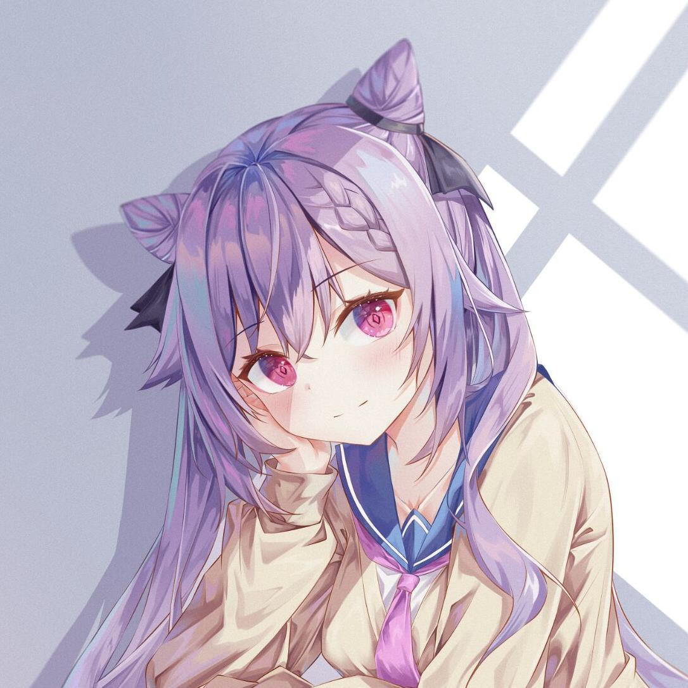

<div align="center">
  <h2>keqing-ui</h2>
  
</div>

<h4 align="center">
    <a href="#">
        
    </a>
    <a href="#">
        
    </a>
    <a href="#">
        
    </a>
</h4>

<p align="center">参考 <a href="https://github.com/element-plus/element-plus">Element-Plus</a> 的 vue3 组件库</p>

## 安装

暂仅支持使用包管理器安装

```bash
npm i keqing-ui

# or use yarn
yarn add keqing-ui

# or use pnpm
pnpm add keqing-ui
```

## 使用

安装完成后，你可以使用以下方式引入整个组件库：

```ts
import { createApp } from 'vue'
// 导入组件库插件
import KqUI from 'keqing-ui'
// 导入组件库样式
import 'keqing-ui/es/style.css'
import App from './App.vue'

const app = createApp(App)

// 注册组件库
app.use(KqUI)
app.mount('#app')
```

在 vue 文件中使用

```vue
<template>
  <kq-button type="primary">按钮</kq-button>
</template>
```

**各组件的详细用法见 [文档](https://lovezhangchuangxin.github.io/keqing-ui/)。**

## 待办

- 完善各个组件，支持更多功能
- 增加单元测试
- 重新构建打包系统，支持按需引入和自动导入
- 增加主题功能

## 感谢

感谢 [Element-Plus](https://github.com/element-plus/element-plus) 的开发者们，本项目参考了 Element-Plus 的源码，学习了其中的很多实现方式。

本项目仅为个人学习项目，有很多不足之处，请勿在生产环境中使用。
